<p align="center">
  
</p>

# 👁 Sentinel

> A real-time terminal system monitor built with Textual

Sentinel gives you full visibility into your machine — CPU, RAM, GPU, disk, network, processes, and services — all inside a fast, modern terminal UI.

---

## ⚡ Features

### 🧠 System Overview
- Live CPU usage (per-core + frequency monitoring)
- RAM & swap usage tracking
- System uptime + load average
- Logged-in users monitoring

---

### 🖥 Hardware Monitoring
- NVIDIA GPU usage (via GPUtil)
- Temperature sensors (CPU / GPU where supported)
- Fan speed monitoring (if available)

---

### 💾 Storage
- Disk usage per partition (used / free / total)
- Real-time disk I/O (read/write speeds)

---

### 🌐 Network
- Live upload/download speeds
- Network interfaces (IP, MAC, traffic stats)
- Active TCP/UDP connections mapped to processes

---

### ⚙ Processes & Services
- Top processes sorted by CPU / RAM
- Searchable process list
- Kill process capability
- System services status:
  - systemd (Linux)
  - launchctl (macOS)
  - PowerShell services (Windows)

---

### 🔋 Power
- Battery percentage
- Charging status
- Estimated remaining time

---

## ⌨️ Controls

| Key   | Action |
|------|--------|
| `q`   | Quit application |
| `1–9` | Navigate between screens |
| Click | Sidebar navigation |

---

## 🧩 Process Screen Controls

| Action | Description |
|--------|-------------|
| Sort (CPU / RAM) | Toggle sorting mode |
| Kill Selected | Terminate selected process |
| Search | Filter processes by name |

---

## 🌐 Connections Screen

| Action | Description |
|--------|-------------|
| All Connections | Show all active connections |
| Listening Only | Show open ports only |

---

## 🚀 Installation

```bash
git clone https://github.com/Abdo-omran2206/SENTINEL.git
cd SENTINEL

python -m venv venv

# activate venv
source venv/bin/activate   # Windows: venv\Scripts\activate

pip install -r requirements.txt
python main.py
````

---

## 📁 Project Structure

```
SENTINEL/
├── main.py              # App entry point & sidebar navigation
├── sentinel.tcss       # Global Textual CSS theme
├── requirements.txt
├── .gitignore
├── logo.svg
│
├── core/                # Pure data-fetching modules (no UI)
│   ├── cpu.py
│   ├── ram.py
│   ├── gpu.py
│   ├── temperatures.py
│   ├── disk.py
│   ├── disk_io.py
│   ├── network.py
│   ├── interfaces.py
│   ├── connections.py
│   ├── processes.py
│   ├── services.py
│   ├── users.py
│   ├── battery.py
│   ├── uptime.py
│   └── system.py
│
├── screens/             # Textual Widget screens (one per view)
│   ├── dashboard.py
│   ├── cpu_screen.py
│   ├── ram_screen.py
│   ├── gpu_screen.py
│   ├── temperatures_screen.py
│   ├── disk_screen.py
│   ├── disk_io_screen.py
│   ├── network_screen.py
│   ├── interfaces_screen.py
│   ├── connections_screen.py
│   ├── processes_screen.py
│   ├── services_screen.py
│   ├── users_screen.py
│   ├── uptime_screen.py
│   └── battery_screen.py
│
└── utils/
    └── formatter.py     # Smart byte/speed formatter (B → TB auto-scale)
```

---

## 🧠 Architecture

* core/ → system data collectors (psutil + OS APIs)
* screens/ → UI views (Textual)
* utils/ → helpers & formatting
* main.py → app entry point

---

## ⚙ Requirements

* Python 3.10+
* Works on Windows / Linux / macOS

### Optional

* GPUtil (NVIDIA GPU monitoring)
* psutil (system metrics)

---

## 📌 Notes

* GPU monitoring works best on NVIDIA GPUs
* Temperature sensors vary by OS
* Windows has limited hardware sensor access
* Load average is not available on Windows
